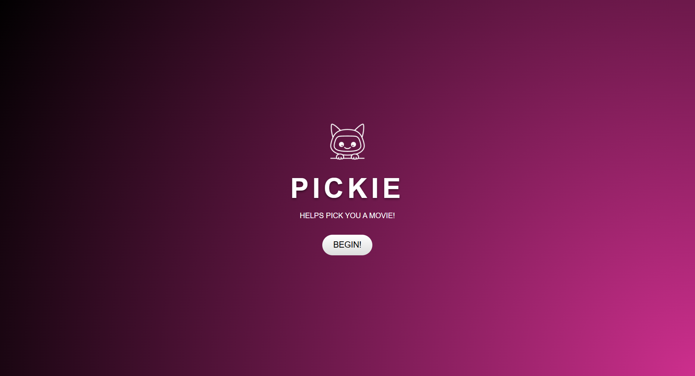

# NLP-Movies-Recommender

Goal:
We’ll be trying to use sentiment analysis to extract a ranked order for sentiments present in the movies dataset
and then match the “genres” from the initial input using a custom model. That model will then simply
attempt to match the best fitted movies from our dataset and output them as recommendations.

## Tools
- **Dataset**: A CSV of movies annotated with genre, emotion scores, and descriptions
- **Embeddings**: SentenceTransformers (`all-MiniLM-L6-v2`) for semantic embeddings of movie descriptions
- **Vector Store**: ChromaDB for fast semantic search over movie data
- **Backend**: Flask (Python) for serving the API endpoints and integrating with the movie dataset
- **Frontend**: React JS with Framer Motion for building an interactive and dynamic user interface
- **Initial Prototype of Frontend** Created using Gradio

## Data Sources:
- Letterboxd (Movies Dataset) via Kaggle:
https://www.kaggle.com/datasets/gsimonx37/letterboxd?select=genres.csv

# How to run dashboard locally:
### 1. Clone the repo

### 2. (Optional but recommended) Create and activate a virtual environment
python -m venv .venv
### On Windows:
.venv\Scripts\activate
### On Mac/Linux:
source .venv/bin/activate

### 3. Install dependencies
pip install -r requirements.txt

### 4. Run the vector embedding processing file of the dataset
python embedding.py

### 5. Run the Flask API file on one terminal
python api.py

### 6. In another terminal, run and start the frontend of the application
cd frontend
npm install
npm install motion
npm start

### 7. Access the App
Visit http://localhost:3000 in your browser.
